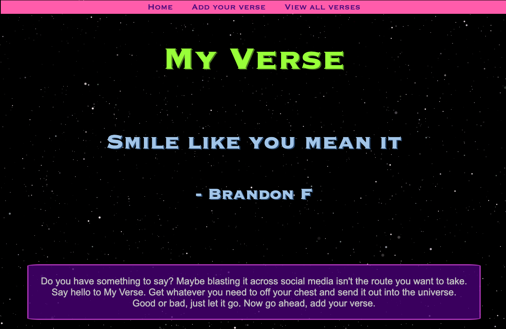
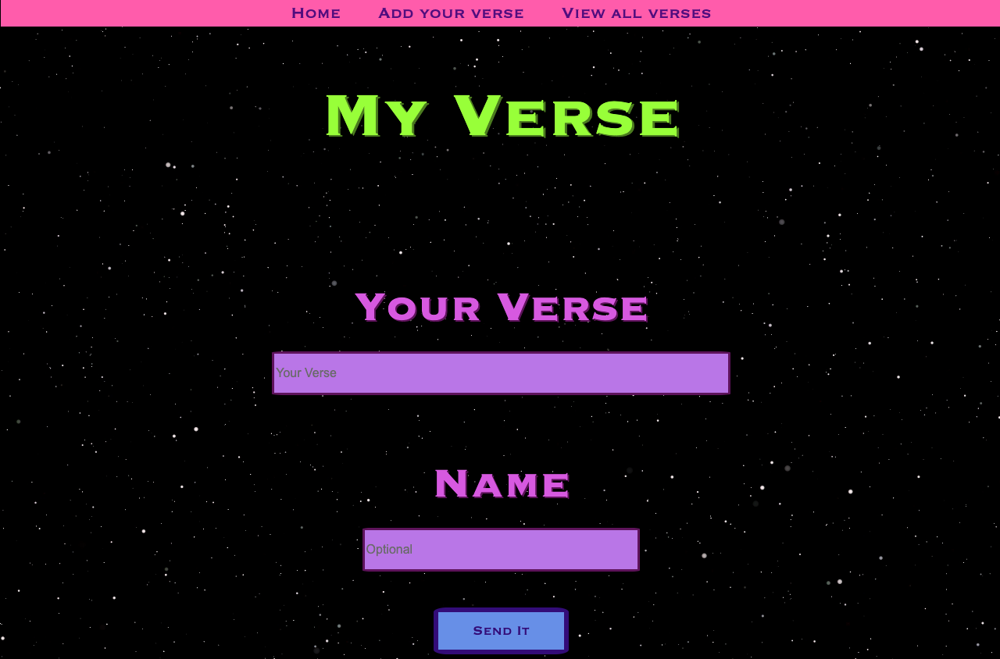
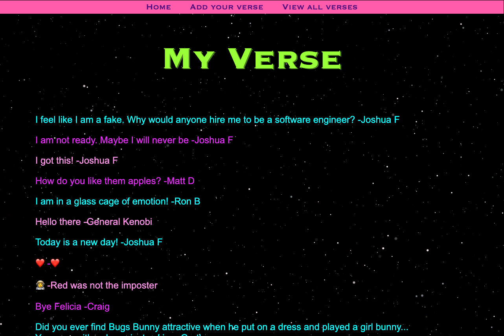
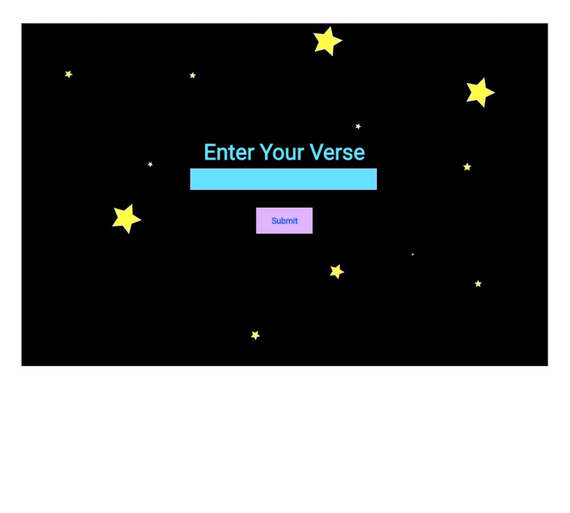
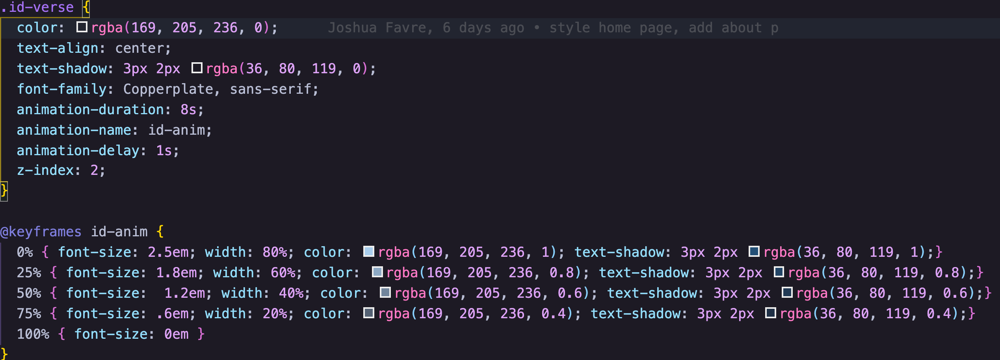
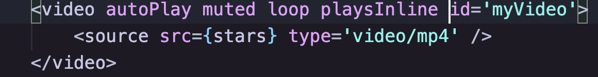

# [My Verse](https://send-my-verse.herokuapp.com/)
### Tell the universe whatever you need to get off your chest.
##### This is a browser based application. It is responsive, built with mobile first design. My Verse is a MERN stack project built for practice as well as, being somewhat therapeutic. I got the idea from wanting to type responses to social media posts, but biting my tongue a lot. I needed a way to say what I wanted and not offend half the people I'm connected to on my social media accounts. The thought of "put it out in the universe... verse... my verse", came to me. I actually enjoy using this app. I hope you will too.

## Home Page
##### This is an image of the home/landing page

## Add Your Verse
##### Here is the form/page where you add your verse

## All Verses
##### A list of all verses added to the app

## Wireframe

## Technologies Used
##### This is a MERN stack project. The React frontend utilizes hooks for the components. The styling was done with vanilla CSS. I opted not to use a CSS framework, just to get reps on styling fundamentals. It was styled for a mobile screen first, with media queries to handle larger screens. Both the frontend and backend are hosted on Heroku, the free tier. However I have set up software to ping the site, using cron-job. This keeps the site from going to sleep throughout most of the day.

## Code bytes
###### Some fun code, CSS to make verse sent back from DB, fade off into the universe. I was able to do this with just CSS, thought I would need some Javascript to accomplish this initially.

###### I had an issue using a background video. It worked fine on my laptop, but on mobile the video wouldn't play. Then it would pop up, just the video with no overlay, on a player. No bueno. I found this simple solution, just add the playsInline attribute to the video tag. Worked like a charm.

## Contribution Guidelines

If you have some cool ideas and would like to contribute, I will definitely consider it. Fork, clone, and send an issue if you have any proposed improvements to the app. Thanks for checking it out.